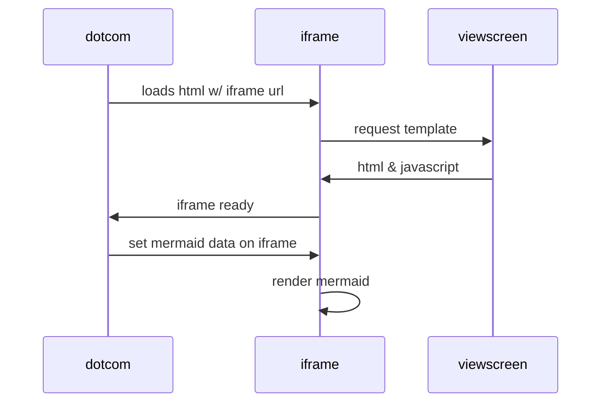

# Справочная информация по работе с git-help

Перечень команд

Команды | Действия
-------------:|---------------------
git init | Создание пустого локального репозитория
git clone | Создание локальной копии репозитория (init не нужна)
git remote | Связывание локально и  удаленного репозиториев
git add | Добавление в индекс
git commit | Добавление изменений
git push| Отправка изменений в GitHub

When $a \ne 0$, there are two solutions to $(ax^2 + bx + c = 0)$ and they are 

$$ x = {-b \pm \sqrt{b^2-4ac} \over 2a} $$
